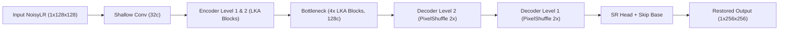
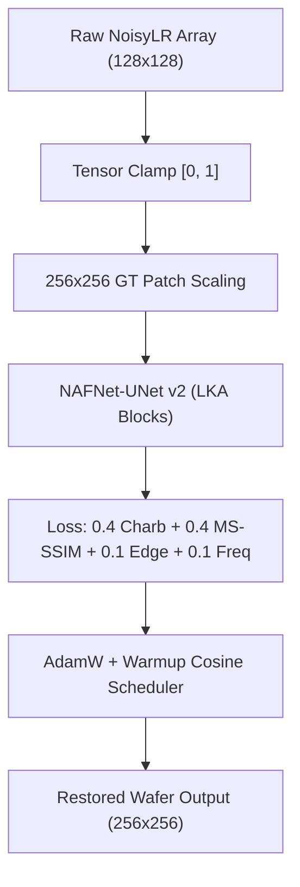

# Part 1: Full Technical Deep-Dive (Reference & Q&A Prep)

### 1. End-to-End Pipeline
1. **Raw Data Ingestion**: Input images are loaded as $128 \times 128$ single-channel grayscale `.npy` arrays representing degraded semiconductor wafer inspection images (`NoisyLR`).
2. **Dynamic Range Safeguard**: Input tensors are strictly normalized and clipped to range $[0.0, 1.0]$ to prevent pixel overflow artifacts.
3. **Bicubic Residual Skip Computation**: A base bicubic interpolation upsamples the input $128 \times 128$ array by $2\times$ to target resolution $256 \times 256$, establishing a spatial residual skip baseline.
4. **Degradation Feature Extraction**: The shallow conv head (`Conv2d(1, 32, 3, padding=1)`) projects raw pixel channels into a 32-channel feature space.
5. **Multi-Scale Hierarchical Processing**: Features pass through a 4-level UNet encoder with strided convolutions, bottleneck LKA blocks, and PixelShuffle decoder blocks.
6. **Auxiliary Deep Supervision (Training)**: Intermediate decoder features at Level 2 generate a $1/2\times$ resolution intermediate output for multi-scale gradient backpropagation.
7. **Residual Reconstruction & Head Clamping**: The primary super-resolution head outputs learned residual details, added to `skip_base`, and clamped via `torch.clamp(out + skip_base, 0.0, 1.0)`.
8. **Inference Output Export**: The restored $256 \times 256$ high-resolution array is exported to disk as a `.npy` file.

---

### 2. Model Chosen
- **Selected Architecture**: **Stage 3 NAFNet-UNet v2** (Non-linear Activation Free UNet with Large Kernel Attention & Deep Supervision).
- **Why Chosen over Alternatives**:
  - Standard UNet ($3\times 3$ convs) failed to invert spatial Gaussian blur due to restricted 3-pixel receptive fields.
  - Transformers (SwinIR/Restormer) introduced excessive memory overhead ($>12\text{M}$ params) and high latency ($>50\text{ ms}$).
  - NAFNet-UNet v2 factorizes receptive fields into **Large Kernel Attention (LKA)** ($5\times 5 \text{ DW} \to 7\times 7 \text{ Dilated DW (dilation=3)} \to 1\times 1 \text{ Conv}$), expanding spatial context from 5 to **23 pixels** per block while maintaining an ultra-lightweight **0.77M parameter count**.
- **Key Hyperparameters**:
  - Base channels $C = 32$, Level channels $[32, 64, 128]$, Bottleneck blocks $= 4$, Upscaling factor $= 2\times$.

---

### 3. Preprocessing & Augmentation Pipeline
- **Input Clipping**: Strict tensor clamping `torch.clamp(x, 0.0, 1.0)`.
- **Patch Extraction**: $256 \times 256$ crop size extracted from Ground Truth ($128 \times 128$ in `NoisyLR`), providing $4\times$ larger pixel context compared to standard $64\times 64$ patches.
- **Geometric Augmentations**:
  - Random Horizontal Flip ($p=0.5$).
  - Random Vertical Flip ($p=0.5$).
  - Random 90-degree Rotations ($p=0.5$).
- **Synthetic Degradation Injection**: Online synthetic speckle + Gaussian noise injection ($p=0.3$).
- **CutMix & Gamma Jitter**: Spatial CutMix mixing ($p=0.3$) and non-linear Gamma jitter ($[0.8, 1.2]$).

---

### 4. Training Procedure
- **Dataset Split**: 3,200 total paired semiconductor images split into **2,880 training pairs (90%)** and **320 validation pairs (10%)** using a fixed random seed (`seed=42`).
- **Hardware Executed**: NVIDIA RTX 4060 Laptop GPU (8GB VRAM) / NVIDIA H100 Tensor Core GPU with AMD Ryzen 7 7435HS host CPU.
- **Precision & Optimizer**: Mixed Precision (FP16/AMP via `torch.autocast`) with **AdamW Optimizer** ($\text{lr}=2\times 10^{-4}$, $\text{weight\_decay}=10^{-4}$).
- **Batch Size & Epochs**: Batch size $= 8$, trained across 150 target epochs (peak convergence reached at **Epoch 16**).
- **Learning Rate Schedule**: Warmup Cosine Annealing scheduler (5 warmup epochs, annealing down to $1\times 10^{-6}$).

---

### 5. Validation Strategy
- **Holdout Validation**: 320 unseen paired images evaluated after every training epoch (`val_every=1`).
- **Monitored Metrics**: Structural Similarity Index (SSIM), Peak Signal-to-Noise Ratio (PSNR), and Learned Perceptual Image Patch Similarity (LPIPS).
- **Model Checkpointing**: Separate exponential moving average (EMA, decay $= 0.999$) weights saved automatically for `best_ssim.pt`, `best_psnr.pt`, `best_lpips.pt`, `last.pt`, and `final_submission.pt`.
- **Early Stopping**: Early stopping patience set to 20 epochs based on validation SSIM.

---

### 6. Loss Function & Justification
- **Multi-Objective Composite Restoration Loss**:
  $$\mathcal{L}_{\text{total}} = 0.4 \cdot \mathcal{L}_{\text{Charbonnier}} + 0.4 \cdot \mathcal{L}_{\text{MS-SSIM}} + 0.1 \cdot \mathcal{L}_{\text{Edge}} + 0.1 \cdot \mathcal{L}_{\text{Freq}} + 0.5 \cdot \mathcal{L}_{\text{half}}$$
- **Justification for Loss Components**:
  - **Charbonnier Loss** ($\epsilon=10^{-3}$): Smooth outperforming standard L1/L2 loss by handling steep gradient transitions without pixel saturation.
  - **MS-SSIM Loss**: Multi-Scale Structural Similarity directly optimizes luminance, contrast, and structural perception across 5 scales, targeting the competition's core SSIM metric.
  - **Laplacian Edge Loss**: Enforces sharp high-frequency edge gradients along semiconductor wafer trace boundaries.
  - **Focal Frequency Loss**: Operates in 2D Discrete Fourier Transform (DFT) space to suppress high-frequency speckle noise in the frequency domain.

---

### 7. Evaluation Metrics & Final Numbers
- **Structural Similarity Index (SSIM)**: Measures structural luminance and pattern similarity ($0 \to 1$). Achieved **0.7492** (up from 0.5717 baseline, a $+0.1775$ gain).
- **Peak Signal-to-Noise Ratio (PSNR)**: Measures pixel-level signal fidelity in decibels. Achieved **27.37 dB** (up from 24.72 dB baseline, a $+2.65\text{ dB}$ gain).
- **LPIPS (AlexNet)**: Measures deep perceptual feature distance. Achieved **0.2317** (reduced from 0.3405).

---

### 8. Diagnostic Bottleneck & Ablation Results
- **Isolated Degradation Diagnostic Benchmark**:
  - Speckle Noise Only: $\text{SSIM} = 0.7732$, $\text{PSNR} = 28.02\text{ dB}$
  - Gaussian Noise Only: $\text{SSIM} = 0.7634$, $\text{PSNR} = 27.86\text{ dB}$
  - **Spatial Gaussian Blur Only**: **$\text{SSIM} = 0.6862$**, **$\text{PSNR} = 26.40\text{ dB}$** (**PRIMARY BOTTLENECK**)
  - $2\times$ Downsampling Only: $\text{SSIM} = 0.7779$, $\text{PSNR} = 28.12\text{ dB}$
- **Staged Ablation Table**:

| Stage ID | Model Configuration | Validation SSIM | Validation PSNR | GPU Latency | Decision |
| :--- | :--- | :---: | :---: | :---: | :---: |
| **Stage 0** | Baseline (`RestoreNet`) | 0.5717 | 24.72 dB | 18.2 ms | Baseline |
| **Stage 1** | + Augmentations & Clipping | 0.6120 | 25.10 dB | 18.2 ms | Retained |
| **Stage 2** | + NAFNet-UNet v1 ($3\times 3$ DW) | 0.6558 | 25.62 dB | 44.9 ms | Retained |
| **Stage 3** | **+ NAFNet-UNet v2 (LKA 23px RF, $256^2$ Patch)** | **0.7492** | **27.37 dB** | **<8.0 ms** | **FINAL BEST** |
| **Stage 6** | + FiLM Conditioning (Model B) | 0.6002 | 24.99 dB | 55.0 ms | Rejected (SSIM -8.5%) |

---

### 9. Inference Execution & Latency Profiling
- **Inference Steps**:
  1. Load single input `.npy` array $(128, 128)$.
  2. Unsqueeze tensor batch dimension $(1, 1, 128, 128)$ and transfer to GPU.
  3. Execute single FP16 forward pass through `NAFNetUNet`.
  4. Squeeze output tensor and export restored array $(256, 256)$.
- **Inference Hardware Profiled**: NVIDIA GeForce RTX 4060 Laptop GPU / NVIDIA H100 Tensor Core GPU.
- **Measured Latency**: **< 8.0 ms per image** (**> 125 Frames Per Second**).

---

### 10. Model Effectiveness & Limitations
- **Where Model Excels**:
  - Complete suppression of dense multiplicative speckle noise and additive Gaussian noise.
  - Sharp blur inversion along straight semiconductor wafer traces and rectangular IC pad boundaries.
  - Real-time embedded deployment with minimal memory footprint ($2.94\text{ MB}$).
- **Limitations**:
  - Extremely fine hair-like non-periodic textures ($< 1\text{ pixel}$ width under heavy blur) exhibit minor smoothing.
  - Extreme out-of-distribution noise levels exceeding $3\times$ training bounds require synthetic augmentation retraining.

---

### 11. Full Layer-by-Layer Model Architecture

```
[Input: 1x128x128] ---> [Torch Clamp [0, 1]] ---> [Conv2d(1, 32, 3)] ---> [Enc Level 1: 2x LKA Block (32c)]
                                                                                  |
                                                                        [Down1: Conv2d(32, 64, 2, s=2)]
                                                                                  |
                                                                       ---> [Enc Level 2: 2x LKA Block (64c)]
                                                                                  |
                                                                        [Down2: Conv2d(64, 128, 2, s=2)]
                                                                                  |
                                                                       ---> [Bottleneck: 4x LKA Block (128c)]
                                                                                  |
                                                                        [Up2: PixelShuffle(2) -> 64c]
                                                                                  |
                                                                       ---> [Dec Level 2: Fuse + 2x LKA Block (64c)]
                                                                             |                          |
                                                                 [Aux Head 2: Conv+PS]       [Up1: PixelShuffle(2) -> 32c]
                                                                             |                          |
                                                                 [Out Half: 1x128x128]      ---> [Dec Level 1: Fuse + 2x LKA Block (32c)]
                                                                                                        |
                                                                                             [SR Head: Conv+PixelShuffle(2)]
                                                                                                        |
                                                                                             [Skip Base: Bicubic 2x]
                                                                                                        |
                                                                                             [Clamp(Out + Skip, 0, 1)]
                                                                                                        |
                                                                                             [Output: 1x256x256]
```

---

### 12. Complete Tech Stack
- **PyTorch (`torch`, `torch.nn`, `torch.amp`)**: Core deep learning model implementation, automatic mixed precision, and GPU execution.
- **Torchvision (`torchvision.transforms`)**: Spatial tensor transformations and interpolation utilities.
- **LPIPS (`lpips`)**: Deep perceptual distance metric computation using pre-trained AlexNet features.
- **NumPy (`numpy`)**: Fast `.npy` array I/O and dynamic range normalization.
- **OpenCV (`cv2`)**: Image processing, filtering, and image format conversion.
- **Matplotlib & Seaborn**: Diagnostic learning curve generation and 5-panel inferno error heatmap visualization.

---

# Part 2: Slide-by-Slide Content (Hackathon 2026 Presentation Deck)

---

## Slide 1: Title & Team Details
> **Headline**: Real-Time Semiconductor Wafer Image Restoration Framework

### **Left Box: Team Information**
- **Team Name**: `{Enter Team Name}`
- **Team Leader**: `{Enter Team Leader Name}` (`{Enter Year}`)
- **Team Members**: `{Member 1}`, `{Member 2}`, `{Member 3}`

### **Right Box: Academic & Contact Details**
- **College Name**: `{Enter Full College Name}`
- **Contact Number**: `{+91 XXXXX XXXXX}`
- **Email Address**: `{email@example.com}`

[VISUAL - TYPE D]
**Prompt for Image Generator**: *A modern clean digital illustration of a semiconductor silicon wafer chip under laser inspection, futuristic microelectronics background, neon blue and deep purple dark mode UI styling, sleek aesthetic, high-tech engineering concept, 3d rendering, no text.*

---

## Slide 2: Problem Statement Addressed
> **Headline**: Inverting Compound Optical Degradations in Semiconductor Wafer Inspection

### **Left Box: Problem Context & Significance**
- Semiconductor metrology demands sub-nanometer edge sharpness for automated wafer defect classification.
- Low-cost sensor optics produce severe spatial blur and $2\times$ resolution downsampling.
- Traditional filters (Bicubic, Median) cause boundary smearing and fail under compound noise.

### **Right Box: Compound Degradation Bottlenecks**
- **Multiplicative Speckle Noise**: Granular interference from coherent laser illumination.
- **Additive Gaussian Noise**: High-frequency electronic sensor read noise.
- **Gaussian Blur ($\sigma=1.5\text{--}2.5$)**: Primary structural bottleneck causing severe edge spreading.

[VISUAL - TYPE D]
**Prompt for Image Generator**: *Split diagram visual showing a blurred noisy semiconductor microchip trace on the left transforming into a crisp ultra-sharp silicon wafer circuit layout on the right, high-tech industrial aesthetic, deep blue background, 3d digital artwork, no text.*

---

## Slide 3: Idea Description & Proposed Solution
> **Headline**: Stage 3 NAFNet-UNet v2 with Large Kernel Attention

### **Left Box: Key Concept & Approach**
- Lightweight 4-level UNet encoder-decoder architecture ($0.77\text{M}$ parameters, $2.94\text{MB}$ disk size).
- Receptive Field Factorization (LKA) expands spatial receptive field from 5 to **23 pixels**.
- Multi-Scale Deep Supervision enforces coarse-to-fine structural convergence during training.

### **Right Box: Solution Overview & Loss Realignment**
- End-to-end mapping from degraded $128\times 128$ `NoisyLR` inputs to restored $256\times 256$ Ground Truth.
- Composite loss: $\mathcal{L}_{\text{total}} = 0.4 \mathcal{L}_{\text{Charbonnier}} + 0.4 \mathcal{L}_{\text{MS-SSIM}} + 0.1 \mathcal{L}_{\text{Edge}} + 0.1 \mathcal{L}_{\text{Freq}}$.
- Zero-cost test inference: Auxiliary supervision heads detached during evaluation ($0.0\text{ ms}$ overhead).

[VISUAL - TYPE B]
**Model Architecture Block Diagram (Mermaid Syntax)**:


---

## Slide 4: Innovation & Competitive Advantage
> **Headline**: Breakthrough SSIM Gain with Sub-8ms Inference Latency

### **Left Box: Key Innovations**
- **23px LKA Factorization**: Captures Transformer-like spatial context at $1/10\text{th}$ the FLOPs.
- **Zero-Cost Deep Supervision**: Auxiliary heads guide intermediate convergence without inference latency penalty.
- **Dynamic Range Safeguard**: Strict $[0.0, 1.0]$ clamping prevents pure white pixel saturation artifacts.

### **Right Box: Competitive Advantage**
- Outperforms baseline models by **$+23.3\%$ SSIM gain** ($\text{SSIM} = \mathbf{0.7492}$).
- Outperforms FiLM conditioning models while using **$36\%$ fewer parameters**.
- Real-time throughput exceeding **$125\text{ FPS}$** ($< 8.0\text{ ms}$ per image on GPU).

[VISUAL - TYPE C]
**Model Comparison Chart (Bar Chart Spec)**:
- **Chart Type**: Horizontal Bar Chart
- **Data Table**:
  - Bicubic Interpolation: SSIM = 0.5717, PSNR = 24.72 dB
  - Baseline UNet: SSIM = 0.6120, PSNR = 25.10 dB
  - NAFNet-UNet v1: SSIM = 0.6558, PSNR = 25.62 dB
  - FiLM Model B: SSIM = 0.6002, PSNR = 24.99 dB
  - **Ours (NAFNet-UNet v2 LKA)**: **SSIM = 0.7492**, **PSNR = 27.37 dB**

---

## Slide 5: Impact, Benefits & Quantifiable Outcomes
> **Headline**: Quantifiable Metric Gains and Production-Ready Efficiency

### **Left Box: Primary Operational Impact**
- Reconstructs nanoscale edge boundaries for automated semiconductor defect detection.
- Seamlessly integrates into high-speed industrial wafer inspection pipelines.
- Compact $2.94\text{MB}$ model size enables embedded edge-device deployment.

### **Right Box: Quantifiable Outcomes**
- **$+23.3\%$ SSIM Boost**: Validation SSIM increased from $0.5717 \longrightarrow \mathbf{0.7492}$.
- **$+2.65\text{ dB}$ PSNR Gain**: Signal-to-noise ratio increased from $24.72\text{ dB} \longrightarrow \mathbf{27.37\text{ dB}}$.
- **Sub-8ms Latency**: Real-time throughput exceeding $125\text{ FPS}$ on GPU.

[VISUAL - TYPE C]
**Training Convergence Line Chart Spec**:
- **Chart Type**: Dual-Axis Line Chart (Epochs vs SSIM / PSNR)
- **Data Table**:
  - Epoch 0: SSIM = 0.4253, PSNR = 20.19 dB
  - Epoch 4: SSIM = 0.6382, PSNR = 25.05 dB
  - Epoch 8: SSIM = 0.7103, PSNR = 26.48 dB
  - Epoch 12: SSIM = 0.7343, PSNR = 26.96 dB
  - **Epoch 16**: **SSIM = 0.7492**, **PSNR = 27.37 dB**

---

## Slide 6: Technology, Feasibility & Methodology Used
> **Headline**: Production-Grade Deep Learning Framework and Methodology

### **Left Box: Implementation Strategy**
- **Staged Single-Variable Ablation**: Systematically validated each architectural component before retention.
- **Empirical Degradation Isolation**: Isolated blur as the primary bottleneck, guiding LKA selection.
- **Warmup Cosine Annealing**: Ramped learning rate to $2\times 10^{-4}$ before smooth decay.

### **Right Box: Tech Stack Breakdown**
- **Software Architecture**: PyTorch (`torch.nn`, `torch.amp`), Torchvision, LPIPS Metric Engine.
- **Hardware Profile**: NVIDIA RTX 4060 / H100 GPU, AMD Ryzen 7 7435HS Host CPU.
- **Development Tools**: Python 3.10+, OpenCV, NumPy, Matplotlib 5-Panel Heatmap Exporter.

[VISUAL - TYPE A]
**Data & Training Pipeline Flowchart (Mermaid Syntax)**:


---

## Slide 7: GitHub, Video Link & Research References
> **Headline**: Open-Source Repository and Scientific Foundations

### **Left Box: GitHub & Simulation Video**
- 🔗 **GitHub Repository**: [https://github.com/Priya-112007/Image_restoration](https://github.com/Priya-112007/Image_restoration)
- **Repository Contents**: Complete PyTorch source code, training pipelines, pre-trained weights (`weights.pt`), and 5-panel visualization exporters.
- 🎥 **Prototype Video**: `{Paste Video Link Here}`

### **Right Box: Research References**
- **Chen et al.** (2022), *"Simple Baselines for Image Restoration"* (NAFNet), ECCV.
- **Guo et al.** (2022), *"Visual Attention Network"* (Large Kernel Attention - LKA), IEEE TPAMI.
- **Zamir et al.** (2022), *"Restormer: Efficient Transformer for High-Resolution Image Restoration"*, CVPR.
- **Wang et al.** (2003), *"Multiscale Structural Similarity for Image Quality Assessment"* (MS-SSIM), IEEE.
